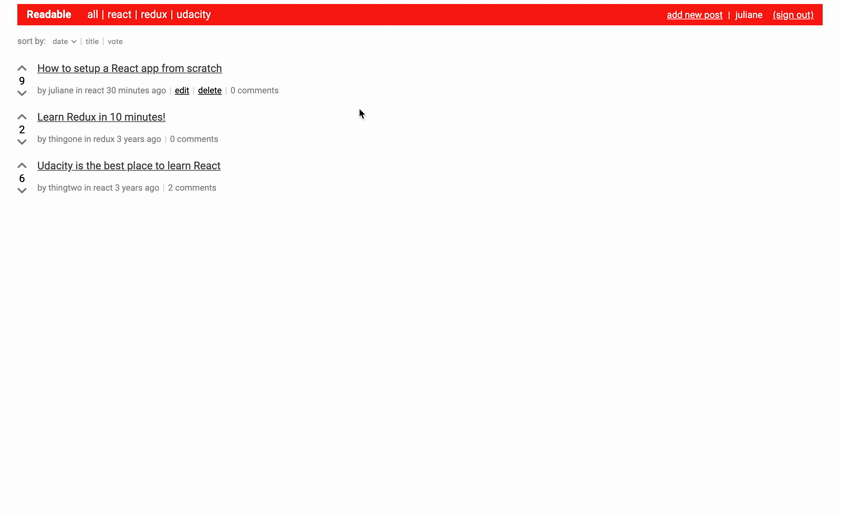

# Readable

Readable is a HackerNews/reddit inspired thread app. It's a basic blogging system that has posts and comments. Users can post content to predefined categories, comment on their posts and other users' posts, and vote on posts and comments. Users will also be able to edit and delete posts and comments.

This is my second project for Udacity's React Nanodegree Program.

I chose to build this project from scratch using React, Webpack, Babel, ESlint, instead of using plain Create React App.

## 👀 Preview



## 🚀 Quick start

1. Download the project and cd into it:

```
git clone https://github.com/junagao/readable-frontend.git
cd readable-frontend
```

2. Install dependencies and run the application:

```
yarn install
yarn start
```

3. Open your browser and navigate:

http://localhost:8080

### Backend Server

- Readable API Server: This application consumes data from an API provided by Udacity, specifically for this project, which can be found at https://github.com/junagao/readable-backend and you can have more information about the endpoints here: [README.md](https://github.com/junagao/readable-backend/tree/master/api-server)

Users will be able to post content to predefined categories, comment on their posts and other users' posts, and vote on posts and comments. Users will also be able to edit and delete posts and comments.

1. Download, install and start the API server:

```
git clone https://github.com/junagao/readable-backend
cd readable-backend
yarn install
node server
```

## 🧐 What's inside?

### Features (Requirements)

- List post by categories:
  - All
  - React
  - Redux
  - Udacity
- List posts:
  - Post title
  - Author
  - Number of comments
  - Current post vote score
- Show post item details:
  - Post title
  - Post body
  - Author
  - Number of comments
  - Current post vote score
  - Comments:
    - Current comment vote score
- Create, edit and delete posts
- Add, edit and delete comment
- Vote on posts and comments

### Additional Features

- Sort posts by date, title and vote: ascending or descending
- Redux-form to manage forms with field validation
- Confirm modal dialog to delete posts or comments
- Google OAuth User Authentication

## 📚 Tech Stack

- Webpack
- Babel
- ESLint
- React
  - react-router
  - react-spinners-kit
  - react-fontawesome
- Redux
- Redux-Thunk
- Redux-Form
- axios
- moment
- lodash
- uuid

## Author

Juliane Nagao - [GitHub](https://github.com/junagao) - [LinkedIn](https://www.linkedin.com/in/junagao/)

## License

This project is licensed under the MIT License.
